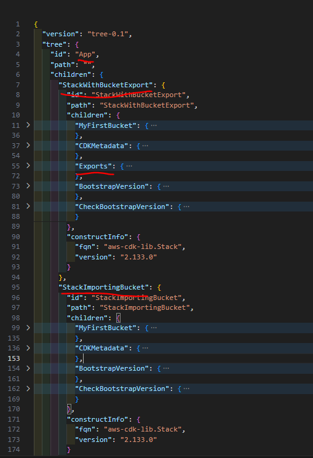

# How to prevent cross tack dependencies in CDK Applications?

AWS CDK has a set of [best practices](https://docs.aws.amazon.com/AWSCloudFormation/latest/UserGuide/best-practices.html) that serve as a guide to efficient use of CDK. There is also a set of [best practices](https://docs.aws.amazon.com/cdk/v2/guide/best-practices.html) for Cloud Formation. As your CDK code will always end up as a set of Cloud Formation templates you need to consider both for optimal setup. 

The problem is that some of these best practices are questionable and based on my teams extensive experience with large CDK code base - there are better approaches. 

I described in this article [CDK / Cloud Formation — do not follow blindly all best practices!](https://medium.com/qoob-dev/cdk-cloud-formation-do-not-follow-blindly-all-best-practices-c529464c8e9d) how to avoid using cross-stack references.

You will encounter the situation where you need to use a resource (name or ARN or some other property) defined in other stack.
The AWS recommended way is to use cross-stack references implemented in Cloud Formation as `Outputs` section (generator side) and `Fn::ImportValue` section (receiver side). But there are huge disadvantages to this approach.

What we want to avoid is that such an object in generated Cloud Formation template (`Export` in `Outputs` section):

```json
{
 "Resources": {
  "MyFirstBucketB8884501": {
   "Type": "AWS::S3::Bucket",
   "Properties": {
    "VersioningConfiguration": {
     "Status": "Enabled"
    }
   },
 ....
 "Outputs": {
  "ExportsOutputRefMyFirstBucketB888450127863B6E": {
   "Value": {
    "Ref": "MyFirstBucketB8884501"
   },
   "Export": {
    "Name": "StackWithBucketExport:ExportsOutputRefMyFirstBucketB888450127863B6E"
   }
  }
 },
```

Why? Because:
- as soon as it will be imported in other stack it will become a problem
- it introduces the anti pattern of using cross-stack dependencies instead of relying on AWS SSM Parameters.


**The question is**: Can we prevent it from happening? If many software developers are contributing to your CDK code, such cross-stack reference may slip past code review and become a problem.

In the article below I will find answers to these questions:
- How to enforce that there are no cross-stack references in the code?
- What is the `CDK Constructs Tree` and how it is related to the problem?
- Can we solve the problem with `CDK Aspects`?
- Can we solve the problem with `CDK native validation mechanism`?


## CDK Constructs tree

The CDK constructs tree is described [here](https://docs.aws.amazon.com/cdk/v2/guide/apps.html#apps-tree)

`cdk synth` produces among others the **tree.json** file in `cdk.out` directory which is a physical representation of the CDK constructs tree:



We see that at the top we have an App object, which children are some stacks which in turn have some other children (tree nodes).


It is a hierarchical structure - a tree with nodes. The stacks are children (nodes) of the App. Stacks have also children. Some of them are regular constructs, but we see also the `CDKMetadata`, `Exports`, `BootstrapVersion` and `CheckBootstrapVersion` nodes. These 4 nodes have predefined names and each has a specific purpose. Within `Exports` node the stack exports are stored.

Expanding the `Exports` section we see our `CfnOutput` construct. It was added because the 2nd stack, `StackImportingBucket`, is importing it  in the code (explicit cross-stack reference).

```json
          "Exports": {
            "id": "Exports",
            "path": "StackWithBucketExport/Exports",
            "children": {
              "Output{\"Ref\":\"MyFirstBucketB8884501\"}": {
                "id": "Output{\"Ref\":\"MyFirstBucketB8884501\"}",
                "path": "StackWithBucketExport/Exports/Output{\"Ref\":\"MyFirstBucketB8884501\"}",
                "constructInfo": {
                  "fqn": "aws-cdk-lib.CfnOutput",
                  "version": "2.133.0"
                }
              }
            },
            "constructInfo": {
              "fqn": "constructs.Construct",
              "version": "10.4.2"
            }
          }
```

## CDK Aspects to the rescue - or not?

Our sample CDK app is available [here](https://github.com/BernardOrzechowski/cdk_prevent_cfn_output/blob/develop/src/app.py)

```python
import os

import aws_cdk as cdk
from stacks.stack_bucket_import import StackImportingBucket
from stacks.stack_with_bucket import StackWithBucketExport

app = cdk.App()

stack_with_bucket_export = StackWithBucketExport(
    app,
    "StackWithBucketExport",
    env=cdk.Environment(
        account=os.getenv("CDK_DEFAULT_ACCOUNT"),
        region=os.getenv("CDK_DEFAULT_REGION"),
    ),
)

stack_importing_bucket = StackImportingBucket(
    app,
    "StackImportingBucket",
    imported_bucket=stack_with_bucket_export.bucket,
    env=cdk.Environment(
        account=os.getenv("CDK_DEFAULT_ACCOUNT"),
        region=os.getenv("CDK_DEFAULT_REGION"),
    ),
)

app.synth()
```

Its a simple CDK app with 2 stacks, where the 2nd one imports an S3 Bucket created by the 1st stack. It has the consequence that in `cdk.out` directory after running `cdk synth` we see that the 1st stack created an Output object and the 2nd stack is importing it (details on this mechanism in this [article](https://medium.com/qoob-dev/cdk-cloud-formation-do-not-follow-blindly-all-best-practices-c529464c8e9d)):


```json
{
 "Resources": {
  "MyFirstBucketB8884501": {
   "Type": "AWS::S3::Bucket",
   "Properties": {
    "BucketName": {
     "Fn::Join": [
      "",
      [
       {
        "Fn::ImportValue": "StackWithBucketExport:ExportsOutputRefMyFirstBucketB888450127863B6E"
       },
       "_2"
    ...
...
```

Currently the command `cdk synth` works. Lets see if we can prevent it. Our goal it that `cdk synth` will fail whenever there is an `Exports` section.


Let's add an `Aspect` that will check for the existence of `cdk.CfnOutput` resource. We will also print the node id to check which stack resources were actually visited.

```python
import aws_cdk as cdk
import jsii
from constructs import IConstruct
from loguru import logger


@jsii.implements(cdk.IAspect)
class CfnOutputAspect:
    """Aspect to validate that no CFN Outputs are created in the stack."""

    def visit(self, node: IConstruct):
        logger.info(f"Visiting node {node.node.id}")
        if isinstance(node, cdk.CfnOutput):
            cdk.Annotations.of(node).add_error(
                '"CFN Output is not allowed in this stack."'
            )
```


And let's add it to the stacks:

```python
import aws_cdk as cdk
import aws_cdk.aws_s3 as s3

from stacks.cfn_output_aspect import CfnOutputAspect


class StackWithBucketExport(cdk.Stack):
    def __init__(self, scope: cdk.App, construct_id: str, **kwargs) -> None:
        super().__init__(scope, construct_id, **kwargs)

        self.bucket = s3.Bucket(self, "MyFirstBucket", versioned=True)

        cdk.Aspects.of(self).add(CfnOutputAspect())
```

Let's check the output of `cdk synth`

```bash
2025-06-05 17:34:18.687 | INFO     | stacks.cfn_output_aspect:visit:12 - Visiting node StackWithBucketExport
2025-06-05 17:34:18.690 | INFO     | stacks.cfn_output_aspect:visit:12 - Visiting node MyFirstBucket
2025-06-05 17:34:18.692 | INFO     | stacks.cfn_output_aspect:visit:12 - Visiting node Resource
2025-06-05 17:34:18.695 | INFO     | stacks.cfn_output_aspect:visit:12 - Visiting node StackImportingBucket
2025-06-05 17:34:18.697 | INFO     | stacks.cfn_output_aspect:visit:12 - Visiting node MyFirstBucket
2025-06-05 17:34:18.699 | INFO     | stacks.cfn_output_aspect:visit:12 - Visiting node Resource
Successfully synthesized to /home/bernard/projects/cdk_prevent_cfn_output/src/cdk.out
Supply a stack id (StackWithBucketExport, StackImportingBucket) to display its template.
```

As seen, sadly the `Exports` tree node is not visited. It seems that the Aspects are only run against explicitly created `CDK Constructs`. Please remember that the `Exports` section in construct tree is created implicitly by CDK due to the explicit cross-stack reference.

Hence `CDK Aspects` can not help us.

## CDK Native validation mechanism

Now let's try the [CDK Construct IValidation](https://docs.aws.amazon.com/cdk/api/v2/python/constructs/IValidation.html) method. 

We will create a `StackValidator` class that implements the `IValidation` protocol. After the section [CDK Constructs tree](#cdk-constructs-tree) we know that we are looking for the stack node child with ID **"Exports"**.

The code below ([github repo link](https://github.com/BernardOrzechowski/cdk_prevent_cfn_output/blob/develop/src/stacks/cfn_output_validator.py)) checks for the existence of such a child node.

```python

import typing as t

import aws_cdk as cdk
import jsii
from constructs import IConstruct, IValidation
from loguru import logger

_STACK_CFN_OUTPUT_SECTION: t.Final[str] = "Exports"


@jsii.implements(IValidation)
class StackValidator:
    def __init__(self, stack: cdk.Stack) -> None:
        self.stack = stack

    def validate(self) -> list[str]:
        errors: list[str] = []
        # For each stack child objects (can be e.g.the Exports section from constructs tree (tree.json))
        # run the validation specific for checking if any Output was created
        for child in self.stack.node.children:
            error_messages = self.validate_cfn_output(child)
            if error_messages:
                errors.extend(error_messages)

        return errors

    def validate_cfn_output(self, stack_child_construct: IConstruct) -> list[str]:
        errors: list[str] = []
        logger.info(
            f"Validating construct {stack_child_construct.node.id} in stack {self.stack.node.id}"
        )
        if stack_child_construct.node.id == _STACK_CFN_OUTPUT_SECTION:
            errors.append("CFN Output is not allowed in this stack.")

        return errors

```

For clarity, in each stack I will add this mechanism and comment out the `Aspect` based solution:

```python
import aws_cdk as cdk
import aws_cdk.aws_s3 as s3

# from stacks.cfn_output_aspect import CfnOutputAspect
from stacks.cfn_output_validator import StackValidator


class StackWithBucketExport(cdk.Stack):
    def __init__(self, scope: cdk.App, construct_id: str, **kwargs) -> None:
        super().__init__(scope, construct_id, **kwargs)

        self.bucket = s3.Bucket(self, "MyFirstBucket", versioned=True)

        # cdk.Aspects.of(self).add(CfnOutputAspect())
        self.node.add_validation(StackValidator(stack=self)) # native CDK validation
```


When we execute `cdk synth` the error we wanted to see is produced. `cdk synth` fails with the message `CFN Output is not allowed in this stack`:


```python
2025-06-05 17:57:39.612 | INFO     | stacks.cfn_output_validator:validate_cfn_output:29 - Validating construct MyFirstBucket in stack StackWithBucketExport
2025-06-05 17:57:39.617 | INFO     | stacks.cfn_output_validator:validate_cfn_output:29 - Validating construct CDKMetadata in stack StackWithBucketExport
2025-06-05 17:57:39.621 | INFO     | stacks.cfn_output_validator:validate_cfn_output:29 - Validating construct Exports in stack StackWithBucketExport
2025-06-05 17:57:39.628 | INFO     | stacks.cfn_output_validator:validate_cfn_output:29 - Validating construct MyFirstBucket in stack StackImportingBucket
2025-06-05 17:57:39.633 | INFO     | stacks.cfn_output_validator:validate_cfn_output:29 - Validating construct CDKMetadata in stack StackImportingBucket
jsii.errors.JavaScriptError: 
  @jsii/kernel.RuntimeError: Error: Validation failed with the following errors:
    [StackWithBucketExport] CFN Output is not allowed in this stack.
      at Kernel._Kernel_ensureSync (/tmp/tmp3phy3gsw/lib/program.js:927:23)
      at Kernel.invoke (/tmp/tmp3phy3gsw/lib/program.js:294:102)
      at KernelHost.processRequest (/tmp/tmp3phy3gsw/lib/program.js:15467:36)
      at KernelHost.run (/tmp/tmp3phy3gsw/lib/program.js:15427:22)
      at Immediate._onImmediate (/tmp/tmp3phy3gsw/lib/program.js:15428:46)
      at process.processImmediate (node:internal/timers:476:21)
```

## Summary

This article explored how to prevent unwanted cross-stack dependencies in `AWS CDK` applications, specifically by blocking the use of `CloudFormation Outputs` section that enable such dependencies. While AWS CDK and `CloudFormation` best practices often recommend cross-stack references, they can introduce maintenance challenges, especially in large or multi-developer environments.

We examined the `CDK Construct Tree` and demonstrated that cross-stack references result in implicit Exports sections in the generated templates. Attempts to use `CDK Aspects` to block these references proved ineffective, as `Aspects` only visit explicitly created constructs, not implicitly generated nodes like Exports.

The solution is to leverage `CDK`'s native validation mechanism by implementing a custom `IValidation` class. This validator inspects the construct tree for the presence of an `Exports` node and fails the synthesis process if found, effectively enforcing the policy of no cross-stack outputs.

By integrating this validation into your stacks, you can ensure that cross-stack references are caught early in the development process, improving the maintainability of your CDK applications. This comparison also shows that there are things that can be done / verified with native validation mechanism, but not with `CDK Aspects`.

Have a great day.


